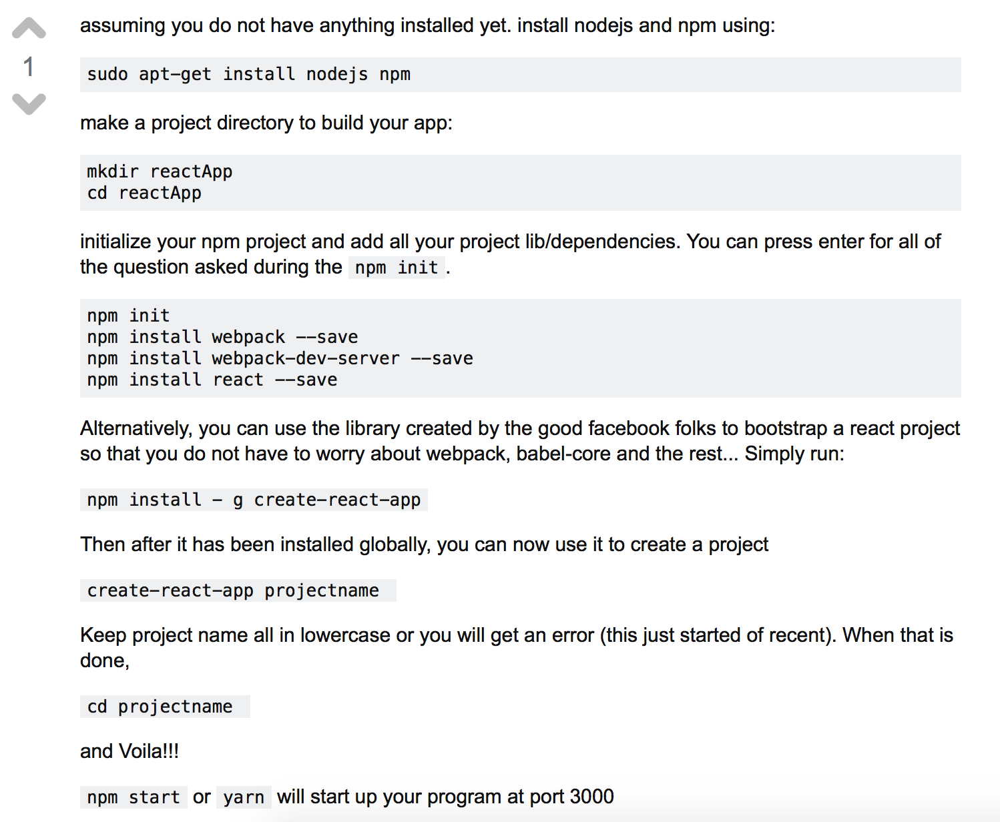

# My First ReactJS Project #

This is a "Hello World" project as I figure out how ReactJS works.

Using the following tutorial as reference: [LearnCode.academy](https://www.youtube.com/watch?v=MhkGQAoc7bc&list=PLoYCgNOIyGABj2GQSlDRjgvXtqfDxKm5b&index=1&t=45s)

## Installing ReactJS ##

This proved quite helpful: [link](https://askubuntu.com/questions/900454/how-do-i-install-reactjs)

## Webpack Configuration ##

[Configuration Gist](https://gist.github.com/learncodeacademy/25092d8f1daf5e4a6fd3)

## Referenced Documentation ##

*[React.JS](https://facebook.github.io/react/docs)*

[webpack](https://www.npmjs.com/package/webpack)

[Babel, ES6 and JSX](https://babeljs.io)
